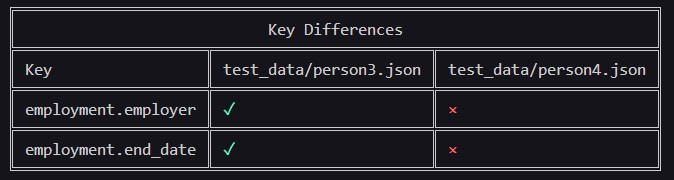
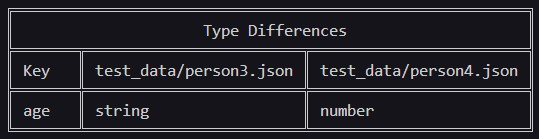

# DataDiffer Terminal

A simple command-line tool that makes your life easier by making differences between data-structures comprehensible.

## Supported formats

| Format | Extension | Supported?                                |
| ------ | --------- | ----------------------------------------- |
| JSON   | .json     | <span style="color:green">Yes</span>      |
| YAML   | .yml      | <span style="color:yellow">Planned</span> |

## Disclaimer

I am a full-stack developer in Java and Typescript and this is my first Rust project as well as the first open-source one. Every feedback or contribution is welcome!

The idea of this tool came to me, as I was trying to figure out, what changed in the response JSON of an API, and I thought, a tool like this could be helpful. I hope it helps someone else too.

## Usage

The general structure of a command is as-follows:

```shell
$ dtf -c path/to/json1 path/to/json2 <OPTIONS>
```

For example the following command displays all the differences between `json1.json` and `json2.json`:

```shell
$ dtf -c ./json1.json ./json2 -ktva
```

You can also chose to write the differences into a file with the option `-w` followed by the file path to save to. It will be saved as `json` too, although the file extension can differ:

```shell
$ dtf -c path/to/json1 path/to/json2 <OTHER OPTIONS> -w path/to/save-to
```

**IMPORTANT:** The options you specify here will define the saved data. If you read this file, you cannot check for differences that weren't defined before saving the file.

To read in the saved file:

```shell
$ dtf -r path/to/read-from <OTHER OPTIONS>
```

### All Options

| Option | Description                                                               |
| ------ | ------------------------------------------------------------------------- |
| `-h`   | Help - Lists all the options and general usage info                       |
| `-V`   | Get the version of DataDiffer currently in use                            |
| `-c`   | Check the 2 data files that follow **separated by space**                 |
| `-r`   | Read saved data from file that follows                                    |
| `-w`   | Write saved data to file that follows                                     |
| `-k`   | Check for/list Key differences if any                                     |
| `-t`   | Check for/list Type differences if any                                    |
| `-v`   | Check for/list Value differences if any                                   |
| `-a`   | Check for/list Array differences if any (Has no effect if used with `-o`) |
| `-o`   | Arrays should be in the same order                                        |

The various options can behave a bit differently if combined in specific ways. We'll go through all the notable phrases and differences next.

## Difference types

Here are all the 4 types of differences data sets can have between them.

### Key difference

Tells you if a field is present in a data set, that's missing from the other.


### Type difference

Tells you if the fields with the same key in 2 data sets have a different type.


### Value difference

Tells you if the fields with the same key in 2 data sets have a different value.

### Array difference

Only works if arrays are not supposed to be in the same order ( the `-o` option is not present )

Tells you if a value is present in an array that's missing from the array with the same key in the other data set.

## Different behaviours from the same options

I will only list here those options, that behave differently under different circumstances. All else should be consistent.

### Checking data sets (`-c` option is used)

The `-r` option is not usable in this case.

All the difference type options (`-k`, `-t`, `-v`, `-a`) represent which checks should be run **and** displayed or saved.

`-w` writes those differences into the file, that are defined as options (`-k`, `-t`, `-v`, `-a`).

### Loading previous check from saved file (`-r` option is used)

The `-c` option is not usable in this case.

All the difference type options (`-k`, `-t`, `-v`, `-a`) represent wich difference tables should be displayed. The checks already ran when the file was written, they can't be run again.

`-w` Although it can be used, it writes those differences into the file, that were defined as options (`-k`, `-t`, `-v`, `-a`) the first time. You can't modify the file this way.

### Using the `-o` option

Although the `-a` option is usable in this case too, it will have no real effect on the results as all the differences between arrays will become Value differences. There won't be any Array difference.
