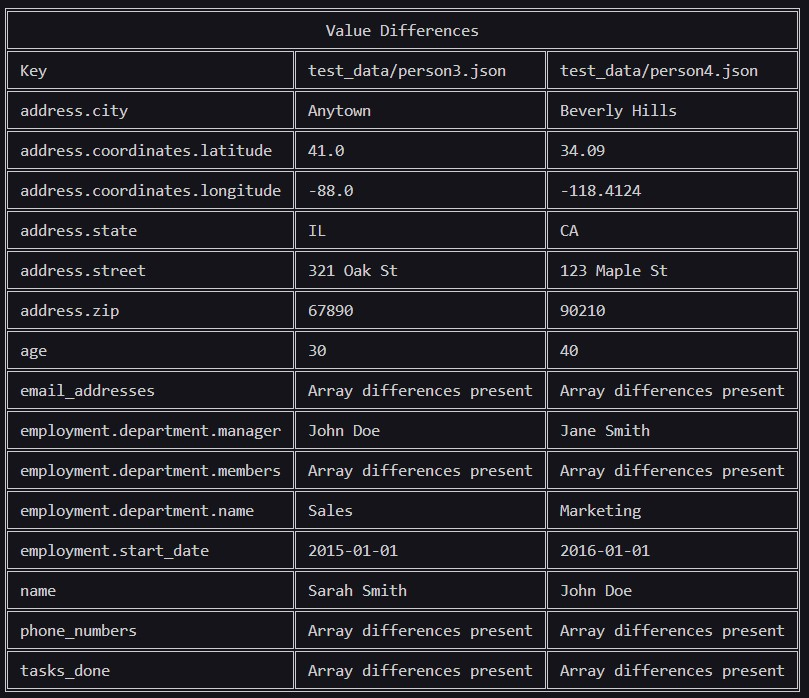

<h1 align="center">DataDiffer Terminal</h1>

[](https://github.com/Rrayor/datadiff-terminal/actions/workflows/rust.yml) 

A simple command-line tool that makes your life easier by making differences between data-structures comprehensible.

Built on [libdtf](https://github.com/Rrayor/libdtf)

#### Table of contents
- [Supported formats](#supported-formats)
- [Disclaimer](#disclaimer)
- [Privacy Note](#privacy-note)
- [Installation](#installation)
  - [Build from source](#build-from-source)
  - [Download built binary](#download-built-binary)
  - [Bonus: How to set the `PATH` variable](#bonus-how-to-set-the-path-variable)
    - [Windows](#windows)
    - [Linux](#linux)
- [Usage](#usage)
    - [All Options](#all-options)
  - [Difference types](#difference-types)
    - [Key difference](#key-difference)
    - [Type difference](#type-difference)
    - [Value difference](#value-difference)
    - [Array difference](#array-difference)
  - [Browser view (`-b` option) **Not released yet!**](#browser-view--b-option-not-released-yet)
  - [Printer friendly (`-p` option)](#printer-friendly--p-option)
  - [No browser (`-n` option)](#no-browser--n-option)
  - [Different behaviours from the same options](#different-behaviours-from-the-same-options)
    - [Checking data sets (`-c` option is used)](#checking-data-sets--c-option-is-used)
    - [Loading previous check from saved file (`-r` option is used)](#loading-previous-check-from-saved-file--r-option-is-used)
    - [Using the `-o` option](#using-the--o-option)
- [For Contributors](#for-contributors)
  - [Thank you for taking interest](#thank-you-for-taking-interest)
  - [The goal](#the-goal)
  - [How to contribute](#how-to-contribute)
  - [Technical guidelines](#technical-guidelines)
  - [Quality guidelines](#quality-guidelines)
  - [Be reasonable](#be-reasonable)
  - [Contact](#contact)


# Supported formats

| Format | Extension   | Supported?                           |
| ------ | ----------- | ------------------------------------ |
| JSON   | .json       | <span style="color:green">Yes</span> |
| YAML   | .yml, .yaml | <span style="color:green">Yes</span> |

# Disclaimer

I am a full-stack developer in Java and Typescript and this is my first Rust project as well as the first open-source one. Every feedback or contribution is welcome!

The idea of this tool came to me, as I was trying to figure out, what changed in the response JSON of an API, and I thought, a tool like this could be helpful. I hope it helps someone else too.

Throughout the development of the first iteration, I used ChatGPT extensively. The code overall is not generated, but I took hints and asked for improvements which either worked and got implemented or not. It was a fun pair-programming experience and I advise anyone to try it out. Because the tool is open source and currently doesn't contain sensitive information, the code can be passed into ChatGPT without significant risk.

# Privacy Note

The code in this repo doesn't send data anywhere. It stores results in a file you specify if you want to and reads the files you specify.

However there are a couple of dependencies used, which we don't have control over, but to the best of my knowledge they don't collect data either. These are:

* [libdtf](https://github.com/Rrayor/libdtf) - This is a sister project and doesn't send data either, although it has it's own dependencies, which should be safe too at this point:
  * [serde_json](https://docs.rs/serde_json/latest/serde_json/)
  * [serde](https://serde.rs/)
* [term_table](https://docs.rs/term-table/latest/term_table/)
* [colored](https://docs.rs/colored/latest/colored/)
* [opener](https://docs.rs/opener/latest/opener/) - From next release
* [clap](https://docs.rs/clap/latest/clap/)
* [serde_json](https://docs.rs/serde_json/latest/serde_json/)
* [serde](https://serde.rs/)

# Installation
Currently there is no classical installation. The app is distributed as portable binaries. There are 2 main ways to get the app working on your system. They overlap after a while, but I put the overlapping parts in both instruction sets.

**IMPORTANT:** Unfortunately I didn't have the opportunity to test on every platform, especially MacOS 😒 I tested on Windows 11 and Ubuntu 22.04.

## Build from source
You can clone the repo and build the app for yourself. This requires some experience with building applications however, but the process shouldn't be too hard.

1. Install Rust and Cargo. We won't cover this in detail, but you can generally follow the steps here: [Install Rust](https://www.rust-lang.org/tools/install)
2. Clone the repo and checkout the branch you'd like to build.
3. Inside the root directory of the project run `cargo build` and find the built binary in the newly generated `target` folder.
4. Copy the binary to wherever you like, and name it however you like. You'll be using the name to run the program from the terminal so the name would better be short. I like `dtf` or `dtft`.
5. Add the folder, where the binary is located to the `PATH` environment variable of your system.
6. Open a new terminal and run the program with the name, you gave it. It should work now.

## Download built binary
You can download the pre-built binaries from the Github releases page.

1. Download the package applicable for your system and extract it to wherever you like. Also name it however you like. You'll be using the name to run the program from the terminal so the name would better be short. I like `dtf` or `dtft`.
2. Add the folder, where the binary is located to the `PATH` environment variable of your system.
3. Open a new terminal and run the program with the name, you gave it. It should work now.

## Bonus: How to set the `PATH` variable

### Windows
1. Press the `Windows key` and start typing `environment variables`. It should offer `Edit the system environment variables`. Open it.
2. Click the `Environment Variables` button around the bottom of the window.
3. In the upper `User variables for {USERNAME}` part search for `Path` and select it.
4. Click `Edit` a new window should pop up.
  * If there is one, click the `New` button and type or paste in the path to the folder the binary is located in.
  * If there is only a text field, type or paste in the path to the folder the binary is located in at the end. Be aware, that entries are separated by `;`.

### Linux
`{Path/to/binary}` represents the path to the folder, your binary is located in.
1. Open a terminal.
2. Run `export PATH = export PATH={Path/to/binary}:$PATH`
3. If you run `echo $PATH`, it should contain the new path.

# Usage

The general structure of a command is as-follows:

```shell
$ dtf -c path/to/json1 path/to/json2 <OPTIONS>
```

For example the following command displays all the differences between `json1.json` and `json2.json`:

```shell
$ dtf -c ./json1.json ./json2 -ktva
```

You can also choose to write the differences into a file with the option `-w` followed by the file path to save to. It will be saved as `json` too, although the file extension can differ:

```shell
$ dtf -c path/to/json1 path/to/json2 <OTHER OPTIONS> -w path/to/save-to
```

**IMPORTANT:** The options you specify here will define the saved data. If you read this file, you cannot check for differences that weren't defined before saving the file.

To read in the saved file:

```shell
$ dtf -r path/to/read-from <OTHER OPTIONS>
```

To produce an HTML file instead and open it in the browser when the program has finished running, you can use [the `-b` flag](#browser-view--b-option).

```shell
$ dtf -c file1.json file2.json -ktva -b diffs.html
```

### All Options

| Option | Description                                                                                                                       |
| ------ | --------------------------------------------------------------------------------------------------------------------------------- |
| `-h`   | Help - Lists all the options and general usage info                                                                               |
| `-V`   | Get the version of DataDiffer currently in use                                                                                    |
| `-c`   | Check the 2 data files that follow **separated by space**                                                                         |
| `-r`   | Read saved data from file that follows                                                                                            |
| `-w`   | Write saved data to file that follows                                                                                             |
| `-k`   | Check for/list Key differences if any                                                                                             |
| `-t`   | Check for/list Type differences if any                                                                                            |
| `-v`   | Check for/list Value differences if any                                                                                           |
| `-a`   | Check for/list Array differences if any (Has no effect if used with `-o`)                                                         |
| `-o`   | Arrays should be in the same order. Works only if the arrays are of the same length too!                                          |
| `-b`   | Browser view: Save the output to an html file with the name that follows **seperated by space** (Has no effect if used with `-w`) |
| `-p`   | A light theme with simpler layout for the browser (Has no effect if used without `-b`)                                            |
| `-n`   | No browser: Will produce the html but won't open the file                                                                         |

The various options can behave a bit differently if combined in specific ways. We'll go through all the notable phrases and differences next.

## Difference types

Here are all the 4 types of differences data sets can have between them.

### Key difference

Tells you if a field is present in a data set, that's missing from the other.


### Type difference

Tells you if the fields with the same key in 2 data sets have a different type.


### Value difference

Tells you if the fields with the same key in 2 data sets have a different value. Array differences being a separate category, arrays with the same key, that differ in value, will appear here but it will only tell you, that "Array differences are present" and won't give you a detailed listing. This is for helping you by letting you know, that there are such differences and you may want to use the `-a` or `-o` options.


### Array difference

Only works if arrays are not supposed to be in the same order ( the `-o` option is not present )

Tells you if a value is present in an array that's missing from the array with the same key in the other data set.


## Browser view (`-b` option)

Has no effect if used with `-w`

Will write to an html file instead of displaying the results in a terminal. The name of the file should be specified after the flag separated by a space.

By default the produced file will open using the system default browser after the program has finished running. This can be turned off by using the [`-n` flag](#no-browser--n-option)

```shell
$ dtf -c file1.json file2.json -ktva -b diffs.html
```


## Printer friendly (`-p` option)

Has no effect without the `-b` flag.

It will provide a light themed html output with a simpler layout.


## No browser (`-n` option)

Has no effect without the `-b` flag.

It will prevent the produced html file from opening when the program has finished running.

## Different behaviours from the same options

I will only list here those options, that behave differently under different circumstances. All else should be consistent.

### Checking data sets (`-c` option is used)

The `-r` option is not usable in this case.

All the difference type options (`-k`, `-t`, `-v`, `-a`) represent which checks should be run **and** displayed or saved.

`-w` writes those differences into the file, that are defined as options (`-k`, `-t`, `-v`, `-a`).

### Loading previous check from saved file (`-r` option is used)

The `-c` option is not usable in this case.

All the difference type options (`-k`, `-t`, `-v`, `-a`) represent wich difference tables should be displayed. The checks already ran when the file was written, they can't be run again.

`-w` Although it can be used, it writes those differences into the file, that were defined as options (`-k`, `-t`, `-v`, `-a`) the first time. You can't modify the file this way.

### Using the `-o` option

Works only if the arrays are of the same length too!

Although the `-a` option is usable in this case too, it will have no real effect on the results as all the differences between arrays will become Value differences. There won't be any Array difference.

If the arrays aren't of the same length they will appear as regular value differences with all of the arrays serialized. Otherwise each value difference will appear in its on row with the index of the array specified.


# For Contributors

## Thank you for taking interest
As this is my first open-source and my first Rust project, I welcome every bit of feedback and code contribution. I am trying my best to offer some information and guidelines, to ease all of our work., but I'm sure things will change as I or rather we will learn from the experience 😄 

## The goal

The simple goal: Help users understand differences between datasets easier and faster.
Example use-cases:
* A front-end developer wants to update their application to work with the new version of an API. If they can't see the difference in the response at first glance, they can use this tool, to help in finding the changes.
* A back-end developer makes some changes in the response of an API and they want to give meaningful information about their changes to their front-end counterparts. They can run a check and save the results to a file, which they can share with the front-end developers, who can load the file and see the changes.
* An application that uses some kind of data stops working, or throws errors from time-to-time. The developers can look for differences between the expected data and the one processed to make debugging easier.

## How to contribute
There are a few ways you can contribute:

* Download the tool and try it out! Have fun 😉 
* If you have any issues or ideas, open an issue for it
* If you know Rust, take a look at the open issues, or if you have your own improvement ideas, open a Pull Request.
* Don't be afraid to flex your proficiency in Rust or software-development in general, but please provide the rest of us some good descriptions of what you have done, or point us in the direction of some of the sources, you've learnt from. We can all learn from each other.
* If you find the tool helpful, maybe share it with others, who are in need of something like this 😊

## Technical guidelines
Please try to follow some technicalities. If there is an issue, the branch is made for, it should contain its identifier and the branch name should hint at what the code should solve.

* Name your branches following these patterns:
  * 'feature/`{identifier-of-issue}`*': For changes that add new functionality to the software
  * 'bugfix/`{identifier-of-issue}`*': For changes that fix or improve existing functionality
* Commit messages should start with `#{identifier-of-issue}` if they are part of solving a Github issue.

## Quality guidelines
Here are some pointers for software quality:
* We should have meaningful unit and integration tests, where possible.
* If you think, something could be tested, which is not, please don't hesitate to implement the tests yourself.
* Always test your code.
* If possible, provide screenshots and/or recordings of your code working in your pull requests!

And some points regarding code quality:
* We should follow the Rust conventions but not blindly.
* Clean code also provides some good directions, but that does not mean, it's always right.
* Make your code simple, and easy on the eyes and mind.
* Always write Rustdoc for your structs and public methods/functions.
* If you can't simplify your code enough, write down your reasoning in comments.
* Don't over-comment.  Good structure and naming is better than good comments every time!
* If you see an opportunity for improvement, take it, don't leave it alone!

## Be reasonable

Some social guidelines, I will try my best to uphold:
* Judge the code, but not the people! If you think, someone has to learn more, help them to it!
* Don't make assumptions, ask questions! Instead of "Don't be lazy!" Maybe try this: "Why did you choose this approach?"
* No kind of personal offenses are welcome of any nature!

Thank you for helping in maintaining the code and keeping the conversations friendly! 🙇

## Contact
If you have any questions or concerns, please reach out via email at [rrayor.dev@gmail.com](mailto:rrayor.dev@gmail.com) or right here in the discussions!
